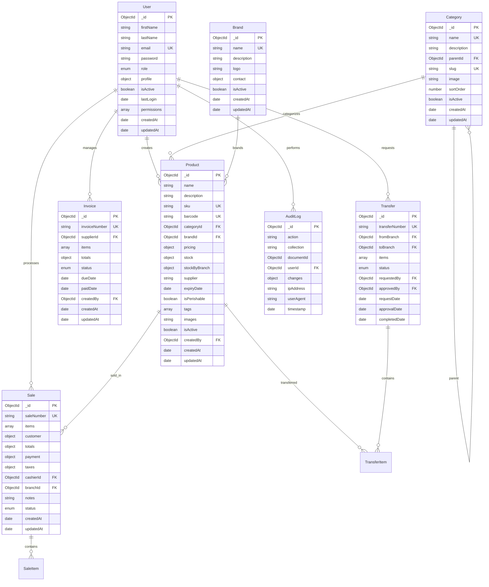
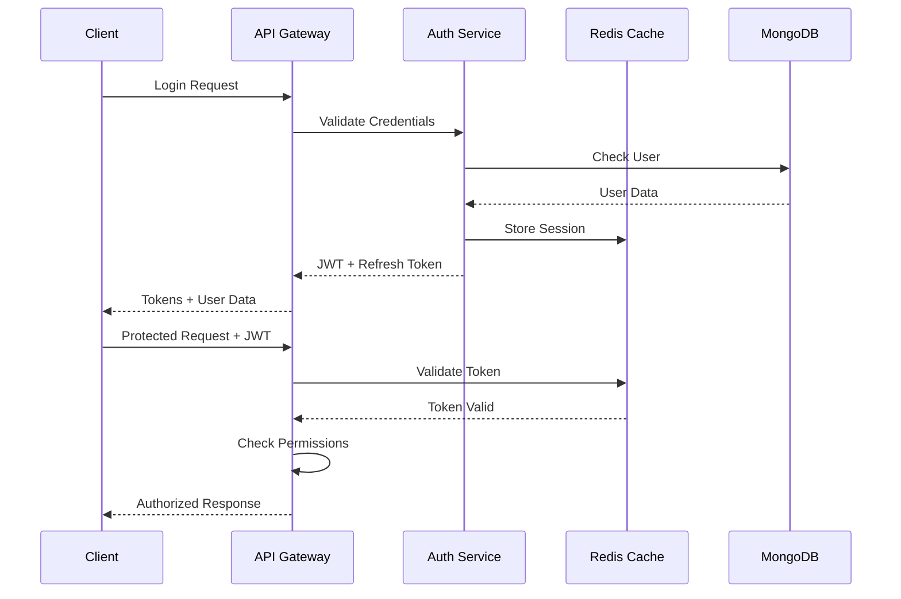
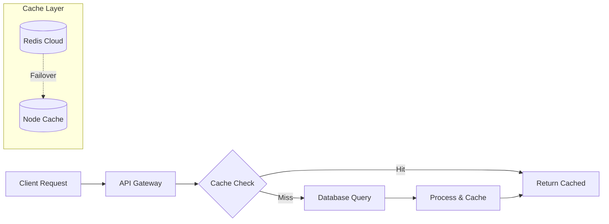

# System Architecture

## Overview

The Supermarket Inventory & Sales Management System is a comprehensive full-stack web application built with modern technologies, featuring advanced caching, email notifications, real-time monitoring, and cloud integrations. The system is designed for scalability, maintainability, performance, and extensibility.

## Architecture Diagram

```mermaid
graph TB
    subgraph "Frontend Layer"
        UI[React 18 App<br/>Vite + Tailwind CSS]
        Comp[UI Components<br/>Reusable Library]
        Context[Context Store<br/>Auth & Theme]
        Router[React Router<br/>Client Routes]
        State[State Management<br/>Context API]
    end

    subgraph "API Gateway & Security"
        Gateway[Express.js Server<br/>Port 5000]
        Auth[JWT Auth + Refresh<br/>Role-Based Access]
        Rate[Rate Limiting<br/>& Request Throttling]
        CORS[CORS Policy<br/>& Security Headers]
        Valid[Input Validation<br/>& Sanitization]
    end

    subgraph "Caching Layer"
        Redis[(Redis Cloud<br/>Primary Cache)]
        Memory[Node Cache<br/>Fallback Cache]
        CacheManager[Cache Manager<br/>Intelligent Routing]
    end

    subgraph "Backend Services"
        AuthSvc[Auth Service<br/>Login/Register/Reset]
        ProdSvc[Product Service<br/>CRUD Operations]
        SalesSvc[Sales Service<br/>Transaction Processing]
        ReportSvc[Report Service<br/>Analytics & PDF]
        DashSvc[Dashboard Service<br/>Metrics & Charts]
        EmailSvc[Email Service<br/>Notifications & Alerts]
        MonitorSvc[Monitoring Service<br/>Inventory Tracking]
    end

    subgraph "Data Layer"
        Mongo[(MongoDB Atlas<br/>Cloud Database)]
        subgraph "Collections"
            Users[users<br/>Authentication & Roles]
            Products[products<br/>Inventory Management]
            Sales[sales<br/>Transaction Records]
            Categories[categories<br/>Product Classification]
            Brands[brands<br/>Brand Management]
            Invoices[invoices<br/>Purchase Records]
            Transfers[transfers<br/>Stock Movements]
            AuditLogs[audit_logs<br/>System Audit Trail]
        end
    end

    subgraph "External Services"
        Gmail[Gmail SMTP<br/>Email Delivery]
        Storage[File Storage<br/>PDF Reports/Images]
        Logger[Winston Logger<br/>Structured Logging]
        Health[Health Monitoring<br/>System Status]
    end

    subgraph "Cloud Infrastructure"
        MongoAtlas[MongoDB Atlas<br/>Database Hosting]
        RedisCloud[Redis Cloud<br/>Caching Service]
        Render[Render.com<br/>Backend Hosting]
        Vercel[Vercel<br/>Frontend Hosting]
    end

    %% Connections
    UI --> Gateway
    Comp --> Context
    Router --> Comp
    State --> Context
    
    Gateway --> Auth
    Gateway --> Rate
    Gateway --> CORS
    Gateway --> Valid
    
    Gateway --> CacheManager
    CacheManager --> Redis
    CacheManager --> Memory
    
    Auth --> AuthSvc
    Gateway --> ProdSvc
    Gateway --> SalesSvc
    Gateway --> ReportSvc
    Gateway --> DashSvc
    Gateway --> EmailSvc
    Gateway --> MonitorSvc
    
    AuthSvc --> Users
    ProdSvc --> Products
    ProdSvc --> Categories
    ProdSvc --> Brands
    SalesSvc --> Sales
    SalesSvc --> Invoices
    SalesSvc --> Products
    ReportSvc --> Sales
    ReportSvc --> Products
    DashSvc --> Sales
    DashSvc --> Products
    EmailSvc --> Gmail
    MonitorSvc --> Products
    MonitorSvc --> EmailSvc
    
    Users --> Mongo
    Products --> Mongo
    Sales --> Mongo
    Categories --> Mongo
    Brands --> Mongo
    Invoices --> Mongo
    Transfers --> Mongo
    AuditLogs --> Mongo
    
    Gateway --> Logger
    Gateway --> Health
    
    Mongo --> MongoAtlas
    Redis --> RedisCloud
    Gateway --> Render
    UI --> Vercel

    classDef frontend fill:#e1f5fe
    classDef backend fill:#f3e5f5
    classDef database fill:#e8f5e8
    classDef external fill:#fff3e0
    classDef cache fill:#fce4ec
    classDef cloud fill:#f1f8e9
    
    class UI,Comp,Context,Router,State frontend
    class Gateway,Auth,Rate,CORS,Valid,AuthSvc,ProdSvc,SalesSvc,ReportSvc,DashSvc,EmailSvc,MonitorSvc backend
    class Mongo,Users,Products,Sales,Categories,Brands,Invoices,Transfers,AuditLogs database
    class Gmail,Storage,Logger,Health external
    class Redis,Memory,CacheManager cache
    class MongoAtlas,RedisCloud,Render,Vercel cloud
```



## System Status Overview

### ✅ Completed Features (90%+ Implementation)

**A. Advanced Authentication & Authorization**
- JWT-based authentication with refresh token support
- Role-based access control (Admin, Manager, Cashier, Viewer)
- Protected routes and API endpoints
- Password reset functionality via email
- User management and profile system
- Session management and security

**B. Comprehensive Inventory Management**
- Complete product CRUD operations
- Category and brand management
- Multi-branch stock tracking
- Advanced search and filtering
- Low stock monitoring with email alerts
- Automated inventory checks every 60 minutes

**C. Sales Processing & Transaction Management**
- Point-of-sale interface
- Real-time stock deduction
- Multiple payment methods
- Transaction history and tracking
- Invoice management
- Receipt generation

**D. Advanced Reporting & Analytics**
- Comprehensive dashboard with real-time metrics
- Sales performance charts and analytics
- Inventory status reports with insights
- PDF report generation and email delivery
- Financial reporting and trend analysis
- Performance monitoring and tracking

**E. Professional Email System**
- Automated low stock alerts
- Password reset emails with secure tokens
- Welcome emails for new users
- Report delivery via email
- Professional HTML email templates
- Gmail SMTP integration with App Password security

**F. High-Performance Caching**
- Redis Cloud integration for distributed caching
- Intelligent fallback to in-memory caching
- Cache invalidation patterns
- Performance monitoring and hit rate tracking
- Optimized database query caching

**G. Security & Performance**
- Rate limiting and request throttling
- Input validation and sanitization
- Comprehensive error handling
- Health monitoring endpoints
- Structured logging with Winston
- Database optimization and indexing
- Date range filtering

**E. Modern UI/UX**
- Responsive design system
- Dark/light theme support
- Component library
- Accessibility features

## Migration Plan to Full Scope

### Phase 1: Foundation & Quality (Week 1-2)
**Priority: Critical**

1. **Development Environment**
   - ✅ ESLint + Prettier configuration
   - ✅ Husky + lint-staged for git hooks
   - ✅ Environment variable management
   - ✅ Shared types/contracts

2. **Backend Infrastructure**
   - ✅ Centralized logging system
   - ✅ Rate limiting and validation
   - ✅ Error handling standardization
   - ✅ API documentation setup

3. **Testing Foundation**
   - Unit tests for controllers
   - Integration tests for APIs
   - Frontend component tests
   - E2E testing setup

### Phase 2: Enhanced Features (Week 3-4)
**Priority: High**

1. **Advanced Inventory**
   - CSV import/export functionality
   - Barcode scanning integration
   - Inventory movement tracking
   - Supplier management

2. **Enhanced Sales**
   - Receipt/invoice generation
   - Return/refund processing
   - Loyalty program integration
   - Advanced discount systems

3. **Advanced Filtering**
   - Multi-criteria search
   - Date range filters
   - Category/subcategory filters
   - Custom field filtering
## Development Roadmap

### ✅ Phase 1: Core MVP (Completed)
**Status: Complete**

1. **Authentication & Authorization ✅**
   - JWT authentication with refresh tokens
   - Role-based access control (Admin, Manager, Cashier, Viewer)
   - Password reset functionality
   - User management system

2. **Product Management ✅**
   - Complete CRUD operations
   - Category and brand management
   - Stock tracking with alerts
   - Advanced search and filtering

3. **Sales System ✅**
   - Point-of-sale interface
   - Transaction processing
   - Real-time inventory updates
   - Payment method handling

### ✅ Phase 2: Advanced Features (Completed)
**Status: Complete**

1. **Email System ✅**
   - Professional email templates
   - Automated low stock alerts
   - Password reset emails
   - Report delivery via email

2. **Caching & Performance ✅**
   - Redis Cloud integration
   - Intelligent cache fallback
   - Database optimization
   - Performance monitoring

3. **Enhanced Reporting ✅**
   - Comprehensive dashboard analytics
   - PDF report generation
   - Sales performance tracking
   - Inventory insights

### 🚧 Phase 3: Business Intelligence (In Progress)
**Priority: Medium**

1. **Advanced Analytics** 🔄
   - Profit/loss analysis
   - Sales forecasting algorithms
   - Inventory optimization recommendations
   - Advanced performance metrics

2. **Enhanced Frontend** 🔄
   - Modern React components
   - Responsive design improvements
   - Real-time updates
   - Advanced UI interactions

3. **Mobile Optimization** 📋
   - Mobile-first responsive design
   - Touch-friendly interfaces
   - Offline capability
   - Progressive Web App features

### 📋 Phase 4: Enterprise Features (Planned)
**Priority: Low**

1. **Multi-Branch Support**
   - Branch management system
   - Inter-branch stock transfers
   - Centralized reporting
   - Branch-specific role access

2. **Integration & APIs**
   - Third-party POS integration
   - Accounting system APIs
   - Barcode scanner integration
   - External reporting tools

3. **Advanced Security**
   - Two-factor authentication
   - Advanced audit logging
   - Data encryption at rest
   - Compliance features

## Technology Stack Details

### Frontend Technologies
- **React 18** - Modern component-based UI library
- **Vite** - Lightning-fast build tool and dev server
- **Tailwind CSS** - Utility-first CSS framework
- **React Router** - Declarative client-side routing
- **Lucide React** - Beautiful, customizable icons
- **Axios** - Promise-based HTTP client
- **Chart.js** - Flexible data visualization library

### Backend Technologies
- **Node.js 18+** - JavaScript runtime environment
- **Express.js** - Fast, minimal web framework
- **MongoDB Atlas** - Cloud-hosted NoSQL database
- **Mongoose** - Elegant MongoDB object modeling
- **JWT** - Secure authentication tokens
- **bcryptjs** - Password hashing library
- **Nodemailer** - Email sending functionality
- **Redis** - High-performance in-memory caching
- **Winston** - Versatile logging library

### Cloud Services & Infrastructure
- **MongoDB Atlas** - Database hosting and management
- **Redis Cloud** - Managed Redis caching service
- **Gmail SMTP** - Reliable email delivery service
- **Render** - Backend application hosting
- **Vercel** - Frontend deployment and CDN
- **GitHub** - Version control and CI/CD

### Development & Quality Tools
- **ESLint** - JavaScript linting and code quality
- **Prettier** - Opinionated code formatting
- **Husky** - Git hooks for quality gates
- **Jest** - JavaScript testing framework
- **Supertest** - HTTP assertion testing
- **Joi** - Object schema validation

## Enhanced Data Architecture

### Core Collections with Relationships



## Security Architecture Details

### Authentication & Authorization Flow



### Role-Based Access Control Matrix

| Resource | Admin | Manager | Cashier | Viewer |
|----------|-------|---------|---------|--------|
| Users | CRUD | R | - | - |
| Products | CRUD | CRUD | R | R |
| Categories | CRUD | CRUD | R | R |
| Sales | CRUD | CRUD | CR | R |
| Reports | CRUD | CRUD | R | R |
| Settings | CRUD | R | - | - |
| Cache | CRUD | R | - | - |
| Email | CRUD | CRU | - | - |

### Security Measures Implementation

1. **Password Security**
   - bcrypt hashing with salt rounds
   - Minimum password requirements
   - Password history tracking
   - Account lockout after failed attempts

2. **Token Security**
   - JWT with expiration (24h access, 7d refresh)
   - Secure token storage recommendations
   - Token blacklisting on logout
   - Refresh token rotation

3. **API Security**
   - Rate limiting (100 req/15min)
   - Request validation with Joi schemas
   - Input sanitization (XSS prevention)
   - CORS configuration
   - Helmet security headers

## Performance Architecture

### Caching Strategy



### Database Optimization

1. **Indexing Strategy**
   - Compound indexes for complex queries
   - Text indexes for search functionality
   - TTL indexes for temporary data
   - Sparse indexes for optional fields

2. **Query Optimization**
   - Aggregation pipelines for analytics
   - Projection to limit returned fields
   - Population strategies for references
   - Connection pooling (10 max, 5 min)

### Performance Monitoring

1. **Response Time Metrics**
   - API endpoint performance tracking
   - Database query performance
   - Cache hit rate monitoring
   - Email delivery tracking

2. **Health Checks**
   - Database connection status
   - Redis connection status
   - Email service availability
   - System resource monitoring

## Deployment Architecture

### Development Environment
```
Local Frontend (Vite:5173) 
    ↓ HTTP
Local Backend (Node:5000)
    ↓ Atlas Connection
MongoDB Atlas (Cloud)
    ↓ Redis Connection  
Redis Cloud (Cache)
    ↓ SMTP
Gmail (Email Service)
```

### Production Environment
```
Vercel CDN (Frontend)
    ↓ HTTPS
Render (Backend Container)
    ↓ Atlas Connection
MongoDB Atlas (Production)
    ↓ Redis Connection
Redis Cloud (Production)
    ↓ SMTP
Gmail (Production Email)
```

### CI/CD Pipeline

1. **Development Workflow**
   - Feature branch creation
   - Local development and testing
   - Pull request with automated checks
   - Code review and approval
   - Merge to main branch

2. **Automated Deployment**
   - GitHub Actions triggers
   - Backend deployment to Render
   - Frontend deployment to Vercel
   - Environment variable management
   - Health check verification

## Scalability Considerations

### Horizontal Scaling Strategies

1. **Database Scaling**
   - MongoDB Atlas auto-scaling
   - Read replicas for read-heavy workloads
   - Sharding for large datasets
   - Connection pooling optimization

2. **Application Scaling**
   - Stateless API design
   - Redis session storage
   - Load balancer configuration
   - Microservices architecture preparation

3. **Performance Optimization**
   - CDN for static assets
   - Image optimization and compression
   - API response caching
   - Database query optimization

### Monitoring & Observability

1. **Application Monitoring**
   - Error tracking and alerting
   - Performance metrics collection
   - User behavior analytics
   - Business metrics tracking

2. **Infrastructure Monitoring**
   - Server resource utilization
   - Database performance metrics
   - Cache performance analytics
   - Network latency monitoring

---

**Architecture Documentation**

*Last updated: September 23, 2025*
*System Status: Production Ready with Advanced Features*
- Bundle size optimization
- Caching strategies

### Backend Optimization
- Response compression
- Request/response caching
- Database query optimization
- Rate limiting

## Monitoring & Logging

### Application Monitoring
- Error tracking (Sentry)
- Performance monitoring
- Uptime monitoring
- Database monitoring

### Logging Strategy
- Request/response logging
- Error logging
- Audit trail logging
- Performance metrics

## Future Enhancements

1. **Microservices Architecture**
   - Service decomposition
   - API Gateway
   - Service mesh
   - Container orchestration

2. **Advanced Analytics**
   - Machine learning integration
   - Predictive analytics
   - Real-time dashboards
   - Business intelligence

3. **Mobile Applications**
   - React Native app
   - Barcode scanning
   - Offline capabilities
   - Push notifications

4. **Integration Capabilities**
   - ERP system integration
   - Payment gateway integration
   - Third-party service APIs
   - Webhook support