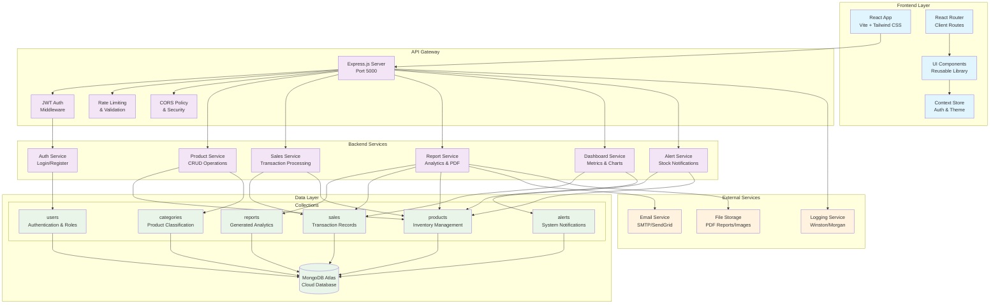
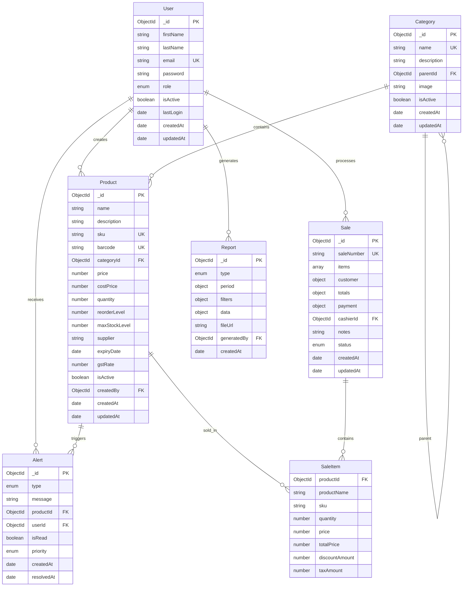

# System Architecture

## Overview

The Supermarket Inventory & Sales Management System is a full-stack web application built with modern technologies, designed for scalability, maintainability, and extensibility.

## Architecture Diagram



## Current State Analysis (A-C Completed)

### ✅ Completed Features (80-85% MVP)

**A. Core Authentication & Authorization**
- JWT-based authentication system
- Role-based access control (Admin, Manager, Cashier)
- Protected routes and API endpoints
- User management and profiles

**B. Inventory Management (CRUD)**
- Complete product management system
- Category-based organization
- Stock level tracking and alerts
- Search and filtering capabilities
- Low stock monitoring

**C. Sales Processing**
- Point-of-sale interface
- Real-time stock deduction
- Multiple payment methods
- Transaction history
- Customer information capture

**D. Reporting & Analytics**
- Comprehensive dashboard
- Sales performance charts
- Inventory status reports
- PDF report generation
- Date range filtering

**E. Modern UI/UX**
- Responsive design system
- Dark/light theme support
- Component library
- Accessibility features

## Migration Plan to Full Scope

### Phase 1: Foundation & Quality (Week 1-2)
**Priority: Critical**

1. **Development Environment**
   - ✅ ESLint + Prettier configuration
   - ✅ Husky + lint-staged for git hooks
   - ✅ Environment variable management
   - ✅ Shared types/contracts

2. **Backend Infrastructure**
   - ✅ Centralized logging system
   - ✅ Rate limiting and validation
   - ✅ Error handling standardization
   - ✅ API documentation setup

3. **Testing Foundation**
   - Unit tests for controllers
   - Integration tests for APIs
   - Frontend component tests
   - E2E testing setup

### Phase 2: Enhanced Features (Week 3-4)
**Priority: High**

1. **Advanced Inventory**
   - CSV import/export functionality
   - Barcode scanning integration
   - Inventory movement tracking
   - Supplier management

2. **Enhanced Sales**
   - Receipt/invoice generation
   - Return/refund processing
   - Loyalty program integration
   - Advanced discount systems

3. **Advanced Filtering**
   - Multi-criteria search
   - Date range filters
   - Category/subcategory filters
   - Custom field filtering

### Phase 3: Business Intelligence (Week 5-6)
**Priority: Medium**

1. **Advanced Analytics**
   - Profit/loss analysis
   - Sales forecasting
   - Inventory optimization
   - Performance metrics

2. **Automated Alerts**
   - Email notifications
   - Low stock alerts
   - Expiry date warnings
   - Sales threshold alerts

3. **Enhanced Reporting**
   - Tax reports
   - Supplier reports
   - Performance dashboards
   - Custom report builder

### Phase 4: Multi-Branch & Scaling (Week 7-8)
**Priority: Low**

1. **Multi-Branch Support**
   - Branch management
   - Inter-branch transfers
   - Centralized reporting
   - Role-based branch access

2. **Advanced Features**
   - Real-time notifications
   - Audit logging
   - Data backup/restore
   - Performance monitoring

## Technology Stack

### Frontend
- **React 18** - Component-based UI library
- **Vite** - Fast build tool and dev server
- **Tailwind CSS** - Utility-first styling
- **React Router** - Client-side routing
- **Chart.js** - Data visualization
- **Axios** - HTTP client

### Backend
- **Node.js** - JavaScript runtime
- **Express.js** - Web framework
- **MongoDB** - NoSQL database
- **Mongoose** - ODM for MongoDB
- **JWT** - Authentication tokens
- **bcryptjs** - Password hashing

### DevOps & Quality
- **ESLint** - Code linting
- **Prettier** - Code formatting
- **Husky** - Git hooks
- **Jest** - Testing framework
- **Winston** - Logging
- **Joi/Zod** - Validation

## Data Architecture

### Core Collections



## Security Architecture

### Authentication Flow
1. User submits credentials
2. Server validates against database
3. JWT token generated with user payload
4. Token stored in client (httpOnly cookie recommended)
5. Token validated on protected routes
6. Refresh token for session management

### Authorization Levels
- **Cashier**: Sales operations, basic inventory view
- **Manager**: Full inventory management, reports
- **Admin**: User management, system configuration

### Security Measures
- Password hashing with bcrypt
- JWT token expiration
- Rate limiting on API endpoints
- CORS configuration
- Input validation and sanitization
- SQL injection prevention via Mongoose

## Deployment Architecture

### Development
```
Frontend (localhost:3000) → Backend (localhost:5000) → MongoDB Atlas
```

### Production
```
Vercel (Frontend) → Render/Heroku (Backend) → MongoDB Atlas
```

## Performance Considerations

### Database Optimization
- Indexing on frequently queried fields
- Aggregation pipelines for complex queries
- Connection pooling
- Query optimization

### Frontend Optimization
- Code splitting and lazy loading
- Image optimization
- Bundle size optimization
- Caching strategies

### Backend Optimization
- Response compression
- Request/response caching
- Database query optimization
- Rate limiting

## Monitoring & Logging

### Application Monitoring
- Error tracking (Sentry)
- Performance monitoring
- Uptime monitoring
- Database monitoring

### Logging Strategy
- Request/response logging
- Error logging
- Audit trail logging
- Performance metrics

## Future Enhancements

1. **Microservices Architecture**
   - Service decomposition
   - API Gateway
   - Service mesh
   - Container orchestration

2. **Advanced Analytics**
   - Machine learning integration
   - Predictive analytics
   - Real-time dashboards
   - Business intelligence

3. **Mobile Applications**
   - React Native app
   - Barcode scanning
   - Offline capabilities
   - Push notifications

4. **Integration Capabilities**
   - ERP system integration
   - Payment gateway integration
   - Third-party service APIs
   - Webhook support