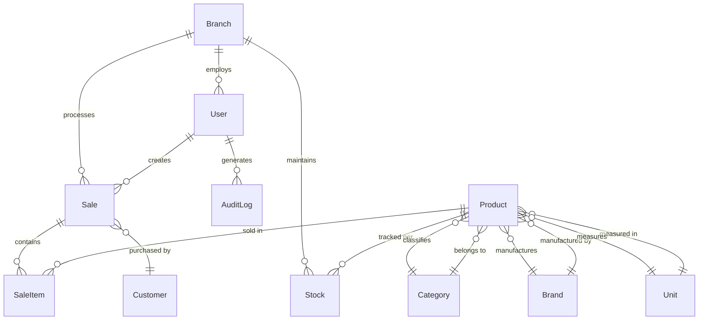

# Part 2: Codebase Map & Data Models

## Codebase Walkthrough

### Backend Structure (`backend/`)

```
backend/
├── app.js                    # Main Express server setup with middleware
├── server.js                 # Server startup script  
├── package.json              # Dependencies & scripts (nodemon, jest, seed)
├── src/
│   ├── config/               # Configuration modules
│   │   ├── database.js       # MongoDB connection & error handling
│   │   ├── cache.js          # Redis Cloud + Node Cache fallback
│   │   ├── demo.js           # Demo mode configuration
│   │   └── swagger.js        # API documentation setup
│   ├── controllers/          # Business logic handlers
│   │   ├── authController.js # Login/register/profile (JWT generation)
│   │   ├── productController.js # Product CRUD + search/filtering
│   │   ├── salesController.js # POS transactions + stock deduction
│   │   ├── dashboardController.js # KPIs + charts data aggregation
│   │   ├── reportsController.js # PDF/CSV generation + email delivery
│   │   ├── inventoryController.js # Stock management + low-stock alerts
│   │   └── masterDataController.js # Categories/brands/units/branches
│   ├── middleware/           # Request processing layers
│   │   ├── auth.js           # JWT verification + role extraction
│   │   ├── validation.js     # Input sanitization + schema validation
│   │   ├── errorHandler.js   # Centralized error responses + logging
│   │   ├── auditLogger.js    # Transaction audit trail recording
│   │   └── advancedRateLimit.js # Per-endpoint rate limiting
│   ├── models/               # Mongoose schemas with business logic
│   │   ├── User.js           # Authentication + roles + permissions
│   │   ├── Product.js        # Inventory items + multi-branch stock
│   │   ├── Sale.js           # POS transactions + line items
│   │   ├── Category.js       # Product classification hierarchy
│   │   ├── Brand.js          # Brand management + logo storage
│   │   ├── Branch.js         # Multi-location support + settings
│   │   └── AuditLog.js       # System activity tracking
│   ├── routes/               # Express route definitions
│   │   ├── authRoutes.js     # POST /login, /register, /profile
│   │   ├── productRoutes.js  # CRUD /products + search + bulk ops
│   │   ├── salesRoutes.js    # POST /sales + GET /sales + analytics
│   │   ├── dashboardRoutes.js # GET /overview + /charts + /alerts
│   │   └── reportsRoutes.js  # GET /sales-report + /inventory-report
│   ├── utils/                # Shared business utilities
│   │   ├── responseUtils.js  # Consistent API response formatting
│   │   ├── tokenUtils.js     # JWT generation + verification helpers
│   │   ├── validationUtils.js # Input validation + sanitization
│   │   ├── emailService.js   # SMTP integration + template rendering
│   │   └── logger.js         # Winston logging with file rotation
│   └── seed/                 # Demo data generation
│       ├── seed.js           # Main seeding script (1200+ products)
│       ├── data/             # Indian market sample data
│       └── utils/            # Seeding helper functions
├── tests/                    # Jest test suites
└── uploads/                  # File storage for product images
```

**Key Extension Points:**
- **Add new API endpoint**: Create route in `/routes/`, controller in `/controllers/`, add validation
- **Add new field to model**: Edit `/models/Product.js`, update controller, add to frontend form
- **Add new middleware**: Create in `/middleware/`, register in `app.js` or specific routes

### Frontend Structure (`frontend/`)

```
frontend/
├── index.html                # Entry HTML with root div
├── package.json              # Dependencies (React, Vite, Tailwind, Axios)
├── vite.config.js            # Build tool configuration + proxy
├── tailwind.config.js        # UI styling system + custom colors
├── src/
│   ├── main.jsx              # React DOM render + global CSS imports
│   ├── App.jsx               # Router setup + lazy loading + error boundaries
│   ├── index.css             # Tailwind imports + custom CSS variables
│   ├── components/           # Reusable UI building blocks
│   │   ├── ui/               # Design system components
│   │   │   ├── Button.jsx    # Variant-based button (primary/secondary/danger)
│   │   │   ├── Input.jsx     # Form input with validation states
│   │   │   ├── Table.jsx     # Data table with sorting + pagination
│   │   │   ├── Modal.jsx     # Overlay dialogs with backdrop
│   │   │   ├── Toast.jsx     # Success/error notifications
│   │   │   ├── Card.jsx      # Content containers with shadows
│   │   │   ├── Badge.jsx     # Status indicators (low-stock, role)
│   │   │   └── Skeleton.jsx  # Loading state placeholders
│   │   ├── shell/            # App layout structure
│   │   ├── ProductModal.jsx  # Product create/edit form dialog
│   │   ├── ConfirmDialog.jsx # Delete confirmation modal
│   │   └── ErrorBoundary.jsx # React error catching + fallback UI
│   ├── pages/                # Route-level components
│   │   ├── Login.jsx         # Authentication form + demo credentials
│   │   ├── Dashboard.jsx     # KPIs + charts + quick actions
│   │   ├── Products.jsx      # Product list + CRUD + search/filter
│   │   ├── Sales.jsx         # POS interface + transaction history
│   │   ├── Inventory.jsx     # Stock levels + alerts + adjustments
│   │   ├── Reports.jsx       # Analytics + PDF generation + email
│   │   └── Settings.jsx      # User profile + system preferences
│   ├── contexts/             # React Context state management
│   │   ├── AuthContext.jsx   # User login state + JWT token handling
│   │   └── ThemeContext.jsx  # Dark/light mode toggle
│   └── utils/                # Frontend utilities
│       ├── api.js            # Axios instance + request/response interceptors
│       ├── auth.js           # Token storage + authentication helpers
│       └── constants.js      # App-wide constants + configuration
└── public/                   # Static assets (favicon, images)
```

**Key Extension Points:**
- **Add new page**: Create in `/pages/`, add route in `App.jsx`, add sidebar link in shell
- **Add form field**: Edit page component, add to form state, update API call
- **Add new component**: Create in `/components/ui/`, export from `index.js`, use across app
- **Add new chart**: Import Chart.js component, add data fetching hook, integrate in dashboard

---

## Data Models & ERD

### Core Entity Relationships



### User Model (`backend/src/models/User.js`)

| Field | Type | Example | Required | Index | Purpose |
|-------|------|---------|----------|-------|---------|
| `email` | String | `admin@supermarket.com` | ✅ | unique | Login identifier |
| `password` | String | `$2a$12$hash...` | ✅ | - | bcrypt hashed password |
| `firstName` | String | `Rajesh` | ✅ | - | Display name component |
| `lastName` | String | `Kumar` | ✅ | - | Display name component |
| `role` | String | `admin` | ✅ | index | RBAC permissions |
| `isActive` | Boolean | `true` | - | - | Account status control |
| `lastLogin` | Date | `2024-10-02T10:30:00Z` | - | - | Security monitoring |
| `permissions` | [String] | `['view_products', 'make_sales']` | - | - | Granular access control |
| `branch` | ObjectId | `ref: Branch` | - | index | Multi-branch assignment |

**Extension Point**: Add `phone`, `address`, `emergencyContact` fields here.

### Product Model (`backend/src/models/Product.js`)

| Field | Type | Example | Required | Index | Purpose |
|-------|------|---------|----------|-------|---------|
| `name` | String | `Amul Milk 1L` | ✅ | text | Product identification |
| `sku` | String | `DAI-AMUL-1001` | ✅ | unique | Inventory tracking code |
| `barcode` | String | `8901030845017` | - | unique | POS scanning |
| `category` | ObjectId | `ref: Category` | ✅ | index | Classification |
| `brand` | ObjectId | `ref: Brand` | ✅ | index | Brand management |
| `unit` | ObjectId | `ref: Unit` | ✅ | - | Measurement (kg, L, pcs) |
| `costPrice` | Number | `45.00` | ✅ | - | Purchase cost (₹) |
| `sellingPrice` | Number | `50.00` | ✅ | - | Sale price (₹) |
| `mrp` | Number | `52.00` | - | - | Maximum retail price |
| `gstRate` | Number | `5` | - | - | Tax percentage |
| `stocks` | [StockSchema] | `[{branch, quantity, reorderLevel}]` | ✅ | - | Per-branch inventory |
| `isActive` | Boolean | `true` | - | index | Product lifecycle |
| `expiryDate` | Date | `2024-12-31` | - | index | Perishable items |

**Stock Sub-Schema:**
| Field | Type | Example | Purpose |
|-------|------|---------|---------|
| `branch` | ObjectId | `ref: Branch` | Location identifier |
| `quantity` | Number | `150` | Current stock level |
| `reorderLevel` | Number | `20` | Low-stock alert threshold |
| `maxStockLevel` | Number | `500` | Inventory capacity limit |
| `reservedQuantity` | Number | `5` | Pending order allocation |

**Extension Point**: Add `supplier`, `batchNumber`, `hsnCode` for advanced inventory.

### Sale Model (`backend/src/models/Sale.js`)

| Field | Type | Example | Required | Index | Purpose |
|-------|------|---------|----------|-------|---------|
| `saleNumber` | String | `INV-2024-001234` | ✅ | unique | Invoice identifier |
| `items` | [SaleItemSchema] | `[{product, quantity, price}]` | ✅ | - | Transaction line items |
| `customer` | ObjectId | `ref: Customer` | - | index | Customer tracking |
| `branch` | ObjectId | `ref: Branch` | ✅ | index | Location tracking |
| `cashier` | ObjectId | `ref: User` | ✅ | index | Staff accountability |
| `subtotal` | Number | `475.00` | ✅ | - | Pre-tax amount |
| `taxAmount` | Number | `47.50` | ✅ | - | Total GST |
| `discount` | Number | `25.00` | - | - | Applied discounts |
| `total` | Number | `497.50` | ✅ | - | Final payable amount |
| `paymentMethod` | String | `cash` | ✅ | index | Payment tracking |
| `status` | String | `completed` | ✅ | index | Transaction state |
| `createdAt` | Date | `2024-10-02T14:30:00Z` | ✅ | index | Sale timestamp |

**SaleItem Sub-Schema:**
| Field | Type | Example | Purpose |
|-------|------|---------|---------|
| `product` | ObjectId | `ref: Product` | Product reference |
| `sku` | String | `DAI-AMUL-1001` | Inventory tracking |
| `quantity` | Number | `2` | Items sold |
| `unitPrice` | Number | `50.00` | Individual item price |
| `total` | Number | `100.00` | Line item total |
| `gstRate` | Number | `5` | Applied tax rate |
| `gstAmount` | Number | `4.76` | Line item tax |

### Category Model (`backend/src/models/Category.js`)

| Field | Type | Example | Required | Purpose |
|-------|------|---------|----------|---------|
| `name` | String | `Dairy & Eggs` | ✅ | Classification name |
| `code` | String | `DAI` | ✅ | SKU prefix generation |
| `description` | String | `Milk, yogurt, cheese...` | - | Category description |
| `gstRate` | Number | `5` | - | Default tax rate for category |
| `isActive` | Boolean | `true` | - | Category lifecycle |

**Extension Point**: Add `parent` field for hierarchical categories (Food > Dairy > Milk).

---

## Navigation

**← Previous**: [Executive Summary & Architecture](01-executive-summary-architecture.md)  
**→ Next**: [API Catalog & Core Flows](03-api-core-flows.md)