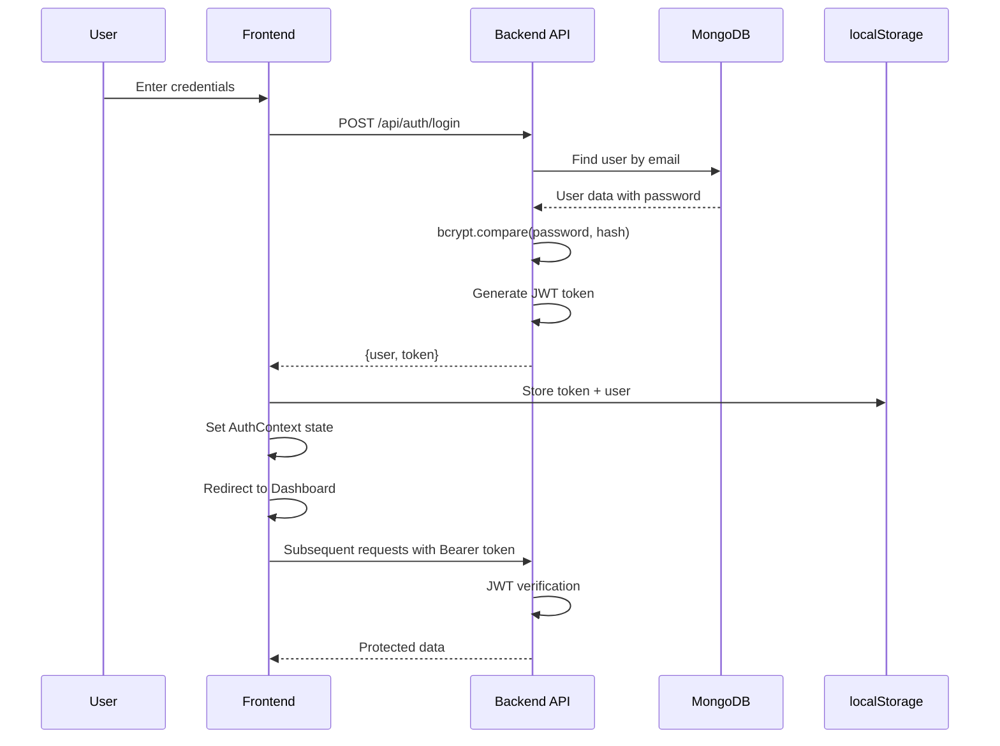
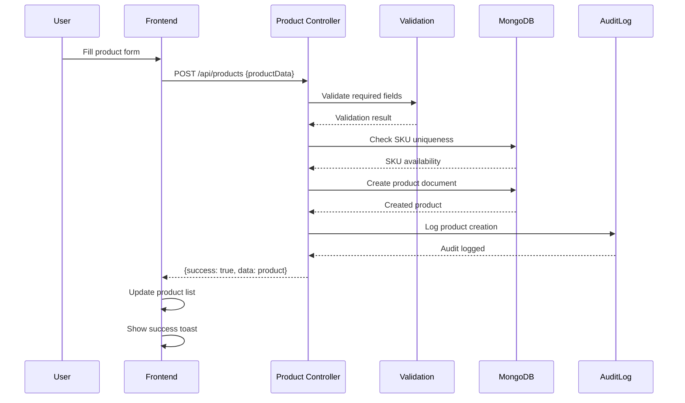
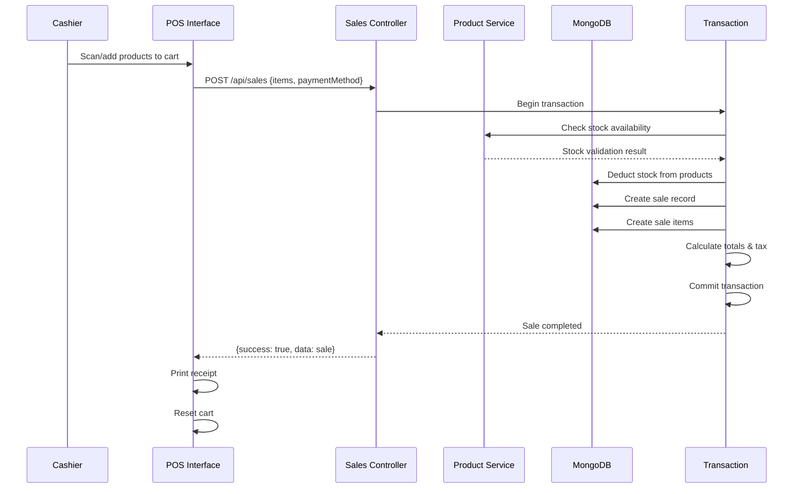
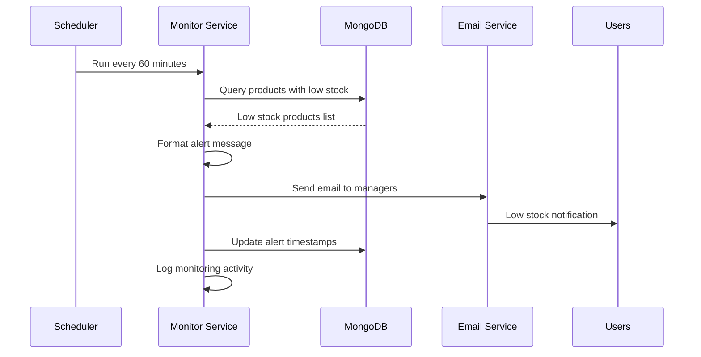
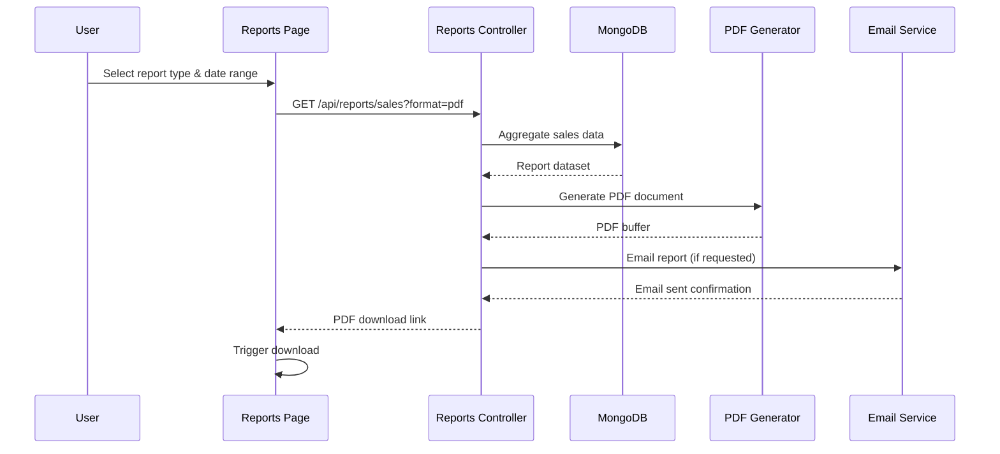

# Part 3: API Catalog & Core Flows

## API Catalog

### Authentication Endpoints (`/api/auth`)

**POST /api/auth/login**
- **Purpose**: User authentication with JWT token generation
- **Headers**: `Content-Type: application/json`
- **Request**: `{email: "admin@supermarket.com", password: "Admin@123456"}`
- **Response**: `{success: true, data: {user: {id, email, role, fullName}, token: "jwt..."}, message: "Login successful"}`
- **Errors**: `401` Invalid credentials, `403` Account deactivated, `400` Validation errors
- **cURL**: 
  ```bash
  curl -X POST http://localhost:5000/api/auth/login \
    -H "Content-Type: application/json" \
    -d '{"email":"admin@supermarket.com","password":"Admin@123456"}'
  ```

**POST /api/auth/register** (Admin only)
- **Purpose**: Create new user account
- **Headers**: `Authorization: Bearer {token}`, `Content-Type: application/json`
- **Request**: `{email, password, firstName, lastName, role: "cashier"}`
- **Response**: `{success: true, data: {user, token}, message: "User registered successfully"}`
- **Errors**: `409` Email exists, `403` Insufficient permissions, `400` Validation errors

**GET /api/auth/profile**
- **Purpose**: Get current user profile information
- **Headers**: `Authorization: Bearer {token}`
- **Response**: `{success: true, data: {user}, message: "Profile retrieved"}`
- **Errors**: `401` Invalid token, `404` User not found

### Product Management (`/api/products`)

**GET /api/products**
- **Purpose**: List products with search, pagination, and filtering
- **Headers**: `Authorization: Bearer {token}`
- **Query Params**: `?page=1&limit=20&search=milk&category=dairy&lowStock=true`
- **Response**: `{success: true, data: [products], pagination: {page, limit, total, pages}}`
- **cURL**:
  ```bash
  curl -H "Authorization: Bearer {token}" \
    "http://localhost:5000/api/products?page=1&limit=10&search=amul"
  ```

**POST /api/products**
- **Purpose**: Create new product with inventory initialization
- **Headers**: `Authorization: Bearer {token}`, `Content-Type: application/json`
- **Request**: 
  ```json
  {
    "name": "Amul Milk 1L",
    "sku": "DAI-AMUL-1001",
    "barcode": "8901030845017",
    "category": "category_id",
    "brand": "brand_id",
    "costPrice": 45.00,
    "sellingPrice": 50.00,
    "stocks": [{"branch": "branch_id", "quantity": 100, "reorderLevel": 20}]
  }
  ```
- **Response**: `{success: true, data: {product}, message: "Product created successfully"}`
- **Errors**: `409` SKU/barcode exists, `400` Validation errors, `403` Insufficient permissions

**PUT /api/products/:id**
- **Purpose**: Update existing product information
- **Headers**: `Authorization: Bearer {token}`, `Content-Type: application/json`
- **Response**: `{success: true, data: {product}, message: "Product updated successfully"}`
- **Errors**: `404` Product not found, `409` SKU conflict, `400` Validation errors

### Sales/POS Operations (`/api/sales`)

**POST /api/sales**
- **Purpose**: Process POS transaction with automatic stock deduction
- **Headers**: `Authorization: Bearer {token}`, `Content-Type: application/json`
- **Request**:
  ```json
  {
    "items": [
      {"product": "product_id", "quantity": 2, "unitPrice": 50.00}
    ],
    "paymentMethod": "cash",
    "customer": "customer_id",
    "discount": 0
  }
  ```
- **Response**: `{success: true, data: {sale}, message: "Sale completed successfully"}`
- **Errors**: `422` Insufficient stock, `400` Invalid product, `403` Insufficient permissions

**GET /api/sales**
- **Purpose**: List sales transactions with filtering
- **Headers**: `Authorization: Bearer {token}`
- **Query Params**: `?page=1&limit=20&startDate=2024-10-01&endDate=2024-10-02&cashier=user_id`
- **Response**: `{success: true, data: [sales], pagination: {page, limit, total}}`

**GET /api/sales/:id**
- **Purpose**: Get detailed sale information for receipt/invoice
- **Headers**: `Authorization: Bearer {token}`
- **Response**: `{success: true, data: {sale}, message: "Sale retrieved"}`
- **Errors**: `404` Sale not found, `403` Access denied

### Dashboard Analytics (`/api/dashboard`)

**GET /api/dashboard/overview**
- **Purpose**: Get complete dashboard data with KPIs and metrics
- **Headers**: `Authorization: Bearer {token}`
- **Response**:
  ```json
  {
    "success": true,
    "data": {
      "todaysSales": 15750.00,
      "totalProducts": 1247,
      "lowStockItems": 23,
      "activeUsers": 8,
      "salesChart": [{"date": "2024-10-01", "amount": 12500}],
      "topProducts": [{"name": "Amul Milk", "quantity": 45}],
      "recentSales": [{"saleNumber": "INV-001", "total": 125.50}]
    }
  }
  ```

**GET /api/dashboard/sales-chart**
- **Purpose**: Get sales trend data for charts
- **Headers**: `Authorization: Bearer {token}`
- **Query Params**: `?period=7d` (7d, 30d, 90d)
- **Response**: `{success: true, data: {chartData: [{date, amount, profit}]}}`

### Reports Generation (`/api/reports`)

**GET /api/reports/sales**
- **Purpose**: Generate sales report with optional PDF export
- **Headers**: `Authorization: Bearer {token}`
- **Query Params**: `?startDate=2024-10-01&endDate=2024-10-02&format=pdf&email=true`
- **Response**: `{success: true, data: {report}, message: "Report generated"}`

**GET /api/reports/inventory**
- **Purpose**: Generate inventory status report
- **Headers**: `Authorization: Bearer {token}`
- **Query Params**: `?lowStock=true&format=csv`
- **Response**: `{success: true, data: {report}, message: "Inventory report generated"}`

---

## Core Flows

### 1. Login Flow



**How to Debug:**
- Check `backend/logs/` for authentication errors
- Verify JWT_SECRET in backend `.env`
- Check browser localStorage for token persistence
- Monitor network tab for 401 responses

### 2. Create Product Flow



**Key Validation Points:**
- SKU uniqueness check in `backend/src/controllers/productController.js`
- Input sanitization in `backend/src/middleware/validation.js`
- Business rules: cost price < selling price < MRP

**How to Debug:**
- Check validation errors in API response
- Verify SKU format follows pattern (CAT-BRAND-####)
- Monitor MongoDB for constraint violations

### 3. POS Sale Flow



**Critical Transaction Points:**
- Stock deduction is atomic in `backend/src/controllers/salesController.js`
- Uses MongoDB transactions to ensure data consistency
- Rollback on any failure (insufficient stock, payment issues)

**How to Debug:**
- Check `stocks.quantity` before/after sale
- Monitor transaction logs for rollback events
- Verify sale totals match item calculations

### 4. Low Stock Alert Flow



**Configuration:**
- Alert threshold: `product.stocks.quantity <= product.stocks.reorderLevel`
- Email templates: `backend/src/utils/emailService.js`
- Monitoring interval: Set in `backend/src/utils/inventoryMonitoringService.js`

### 5. Report Generation Flow



**Report Types Available:**
- **Sales Report**: Revenue, profit, transactions by date range
- **Inventory Report**: Stock levels, low stock alerts, stock movements
- **Product Performance**: Best/worst selling products, category analysis
- **Financial Summary**: Tax collected, payment method breakdown

**Extension Point**: Add custom report builder in `backend/src/controllers/reportsController.js`

---

## Navigation

**← Previous**: [Codebase Map & Data Models](02-codebase-data-models.md)  
**→ Next**: [Frontend UX Guide & Security](04-frontend-security.md)